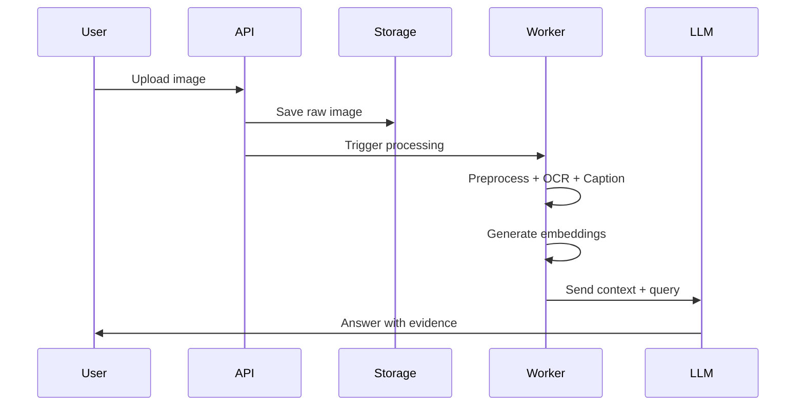
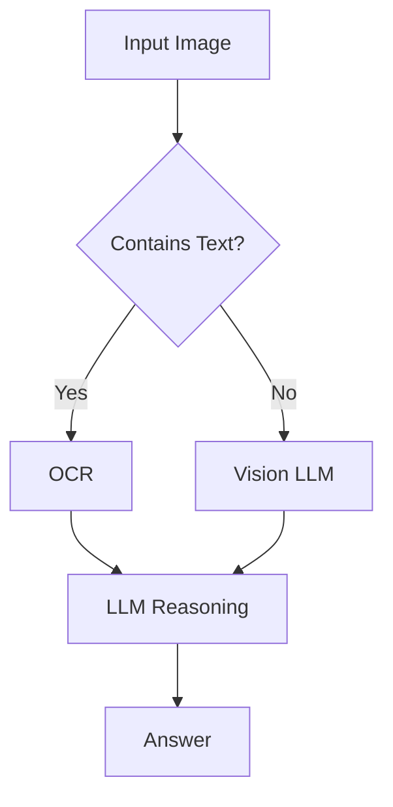
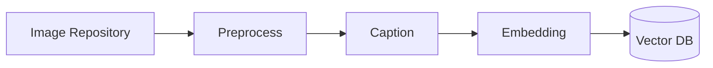
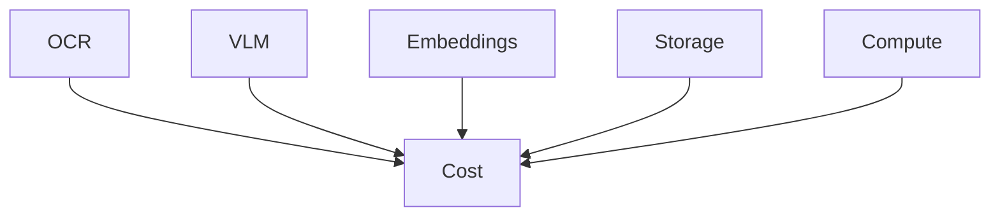
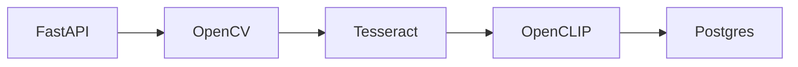
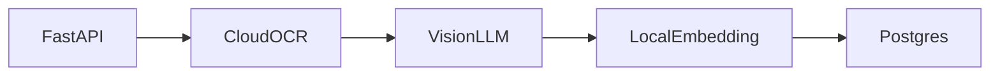

# Image Processing & Understanding  
**R&D by Debojyoti Chakraborty**

---

## Goals

### Requirement 1
User uploads an image → system processes → understands → answers the user.

### Requirement 2
Existing images → vectorized → stored → searchable (RAG / dedup).

---

## 1. High-Level Architecture

```mermaid
flowchart LR
    U[User / System] --> API[FastAPI Upload API]
    API --> S[Object Storage<br/>(S3 / MinIO)]
    S --> W[Async Worker]
    W --> P[Preprocessing]
    P --> O[OCR Engine]
    P --> C[Vision Caption Model]
    C --> E[Embedding Model]
    O --> DB[(Postgres + pgvector)]
    E --> DB
    DB --> LLM[LLM / VLM]
    LLM --> A[Final Answer]
```

**Why this works**
- Raw image stored once
- Everything else is derived
- Components replaceable independently
- Enterprise‑safe and auditable

---

## 2. Use Case A — User Image → Answer

### 2.1 Processing Pipeline



### 2.2 Processing Stages

| Stage | Action | Output |
|-----|------|------|
| Validate | Type, size, EXIF | Safe image |
| Preprocess | Denoise, deskew | Clean image |
| OCR | Text extraction | Text + layout |
| Caption | Semantic summary | Tags + caption |
| Embed | Vectorization | Image vector |
| Retrieve | Similarity search | Context |
| Answer | LLM reasoning | Final answer |

---

## 3. OCR vs Vision LLM



---

## 4. Use Case B — Batch Image Indexing



### Stored Metadata

| Field | Purpose |
|----|----|
| image_id | Unique ID |
| storage_uri | Object path |
| image_embedding | Similarity |
| caption | Semantics |
| caption_embedding | Text search |
| ocr_text | Documents |
| tags | JSON metadata |
| tenant_id | Multi‑tenant |

---

## 5. Tooling Landscape

### OCR
- Tesseract
- EasyOCR
- Google Document AI
- AWS Textract

### Vision & Captioning
- Gemini Vision
- OpenAI Vision
- Open‑source caption models

### Embeddings
- CLIP / OpenCLIP
- Azure Vision Embeddings

### Vector Databases
- pgvector (Postgres)
- Pinecone
- Weaviate
- Milvus

---

## 6. Cost Model



**Cost Control Levers**
- Cache OCR results
- Embed once, reuse forever
- Call Vision LLM only when needed

---

## 7. V1 Architecture Blueprints

### Low‑Cost / Self‑Hosted



### Enterprise Balanced



---

## 8. Deliverables

- `/upload-image`
- Async processing workers
- `/ask-image`
- `/search-image`
- Logs, retries, metrics

---

**Status:** Production‑ready documentation
