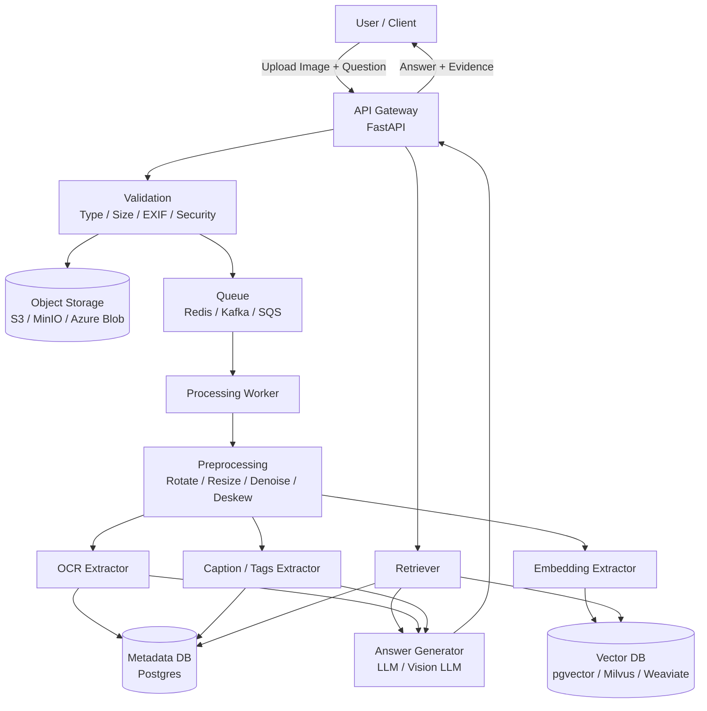
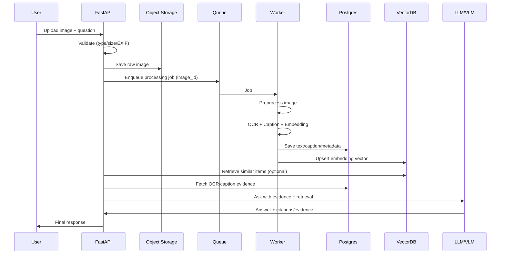
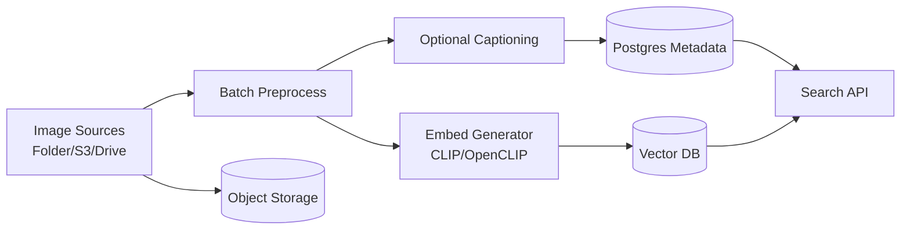
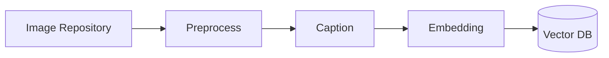
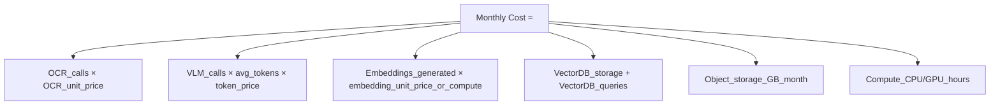

# Image Processing & Understanding  
**R&D by Debojyoti Chakraborty**

---

## Goals

### Requirement 1
User uploads an image → system processes → understands → answers the user.

### Requirement 2
Existing images → vectorized → stored → searchable (RAG / dedup).

---

## 1. High-Level Architecture

## 2. Use Case A — User Image → Answer

### 2.1 Sequence diagram (runtime)

## 3. Use Case B — Existing Images → Vectorize (Batch indexing)
### 3.1 Batch pipeline

---

## 4. Use Case B — Batch Image Indexing

## 5. Cost Breakdown
### 5.3 A practical cost formula

